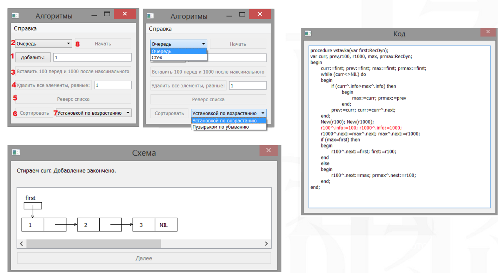

# Формирование и обработка связанных списков и графическая иллюстрация решения задач

Пошаговая визуальзация алгоритмов над связными списками с подсветкой исполняемого кода.

Междисциплинарная курсовая работа за 3 курс  
Галайко Никита ДКИ БИВ-135  
МИЭМ НИУ ВШЭ  
